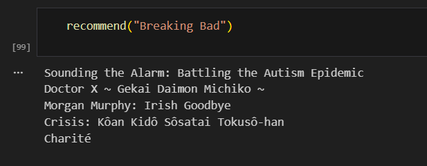

# Content-Based Movie Recommendation & Genre Classification System

## Overview
This project builds a content-based movie recommendation system and a multi-label genre classifier using classical NLP techniques.

## Features
- Content-based movie recommendation using TF-IDF and cosine similarity
- Multi-label genre classification using One-vs-Rest LinearSVC
- Data cleaning and preprocessing on real-world movie dataset
- Text feature engineering using TF-IDF

## Dataset
IMDb-based movie dataset containing:
- Movie title
- Genre
- Rating
- Plot description
- Votes
- Runtime
- Gross earnings

## Technologies Used
- Python
- Pandas
- NumPy
- Scikit-learn
- TF-IDF
- Cosine Similarity
- LinearSVC

## Example Outputs

Recommendation Example:
Breaking Bad → Suggested Shows

Genre Prediction Example:
Input: "A group of teenagers face supernatural forces in a small town."
Predicted Genres: Drama, Fantasy, Horror

